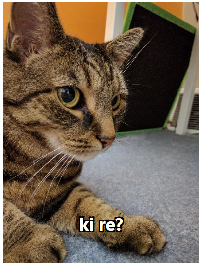

# Daily Cat

Daily cat is a Chrome web extension that shows you a cat picture when you click on the extension icon. It's a simple project that I made to learn how to create a Chrome extension.

> version 1.0  
> Developed by [Adib Sakhawat](github.com/sakhadib)

## Installation
1. [Click Here](https://github.com/sakhadib/Daily_Cat_Extension/archive/refs/heads/main.zip) to download this extension.
2. Go to extension page in Chrome browser.
3. Enable developer mode.
4. Click on `Load unpacked` and select the downloaded folder.
5. You are ready to go!

## Usage
Click on the extension icon to see a cat picture. 
 
 

